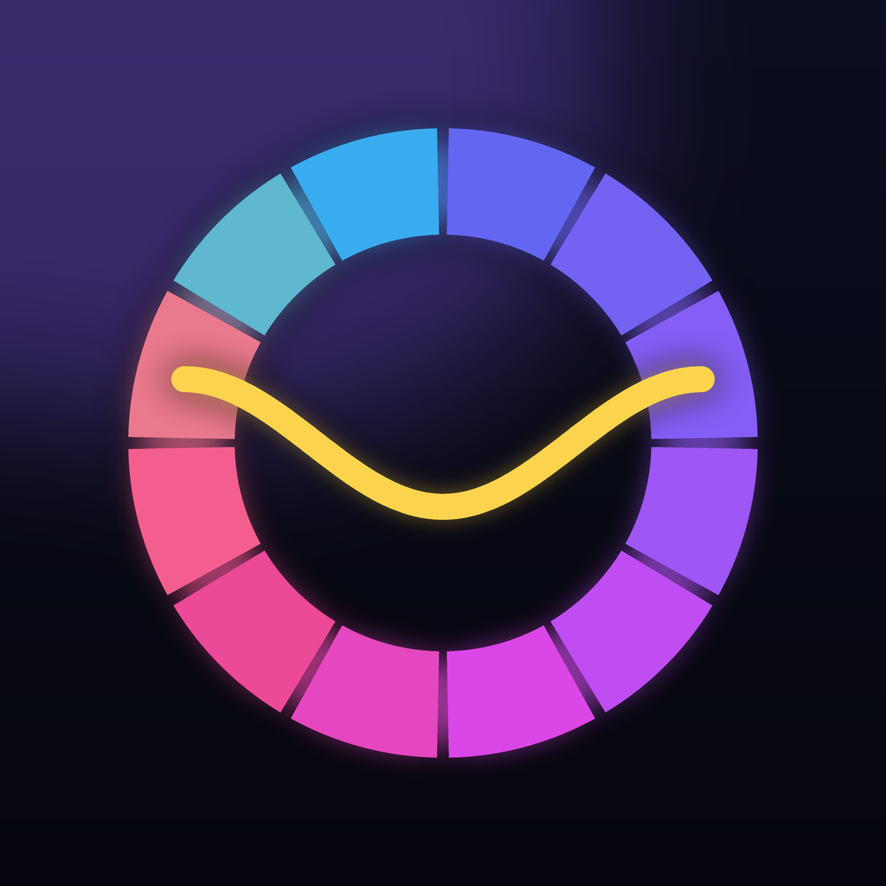

# Theory of Time

An interactive music theory and production course for iOS. Beginner to expert,
with every sound synthesised live on the device.

<p align="center">
  
</p>

## What it is

A structured path from "what is a note" to reharmonisation and mastering, built
around the idea that music theory has to be **heard** to be learned. Nothing in
the app is a static diagram: the filter curve is the filter you're hearing, the
ADSR envelope is the one shaping the note, and the circle of fifths plays a
cadence in whichever key you tap.

**11 stages · 41 lessons · 189 lesson cards · 10 practice drills · 19 studio tools · 52 glossary entries**

| Tier | Stages |
| --- | --- |
| Foundation | First Sounds · Intervals |
| Developing | Scales & Keys · The Modes · Chords |
| Proficient | Harmony in Motion · Rhythm & Groove · Sound Design |
| Advanced | Chromatic Harmony · Arrangement & Mixing |
| Expert | Composition |

## How it's built

```
src/
  theory/      Pure TypeScript music engine — no UI, no audio, fully tested
  audio/       Web Audio graph, synth voices, sequencer, React bindings
  content/     The curriculum as data: lessons, drills, glossary, tools
  drills/      Procedural question generation
  state/       Persisted progress, settings, and SM-2 spaced repetition
  theme/       Design tokens
  components/  UI primitives, music visuals, and lesson widgets
app/           expo-router file-based routes
```

### The theory engine

Notes are stored as `(letter, alteration, octave)` rather than as semitone
numbers, because spelling carries meaning: `G♯` and `A♭` are the same key on a
piano but different notes in context. That one decision is what lets the engine
name intervals, spell scales and build key signatures correctly — `F♯` major
comes out as `F♯ G♯ A♯ B C♯ D♯ E♯`, not with a stray `F`.

It covers pitch and frequency, intervals with correct quality, 35 scales and
modes, 33 chord qualities with symbol parsing and voicings, key signatures,
Roman numeral analysis, 25 annotated progressions, meter and Euclidean rhythm,
and reverse analysis (chord identification, key estimation).

Run the test suite:

```bash
npm run test:theory   # 93 assertions covering the facts the app teaches
npm run typecheck
```

### The audio engine

No samples ship with the app. Every instrument is built at runtime from
oscillators, filters and envelopes through `react-native-audio-api`, which
exposes a native Web Audio graph:

```
oscillator layers → layer gain → filter → amp envelope ─┬─→ dry ──→ master
                                                        └─→ send → reverb ─┘
master → soft-clip limiter → destination
```

That keeps the bundle small, lets any note in any octave play instantly, and —
the reason it actually matters here — means the synthesis parameters are
themselves teachable material. The Sound Design lessons drive the same code
path that plays the chords in the harmony lessons.

Sequencing uses the standard lookahead pattern: a coarse JS timer schedules
events onto the audio clock a short window ahead, so timer jitter never reaches
the output.

## Running it

### Requirements

`react-native-audio-api` contains native code, so **this app cannot run in Expo
Go** — it needs a development build. Building for iOS requires macOS with Xcode,
or EAS Build.

### Development build

```bash
npm install

# On a Mac:
npx expo run:ios

# Or build in the cloud (works from any OS):
npx eas build --profile development --platform ios
```

Then start the dev server:

```bash
npx expo start --dev-client
```

### Getting it on your phone (Xcode)

There is no `ios/` folder in the repo — it is generated on demand and
gitignored. You do **not** need `ascAppId` or `appleTeamId` for this; those are
only for automated App Store submission.

First, change `expo.ios.bundleIdentifier` in `app.json` to something you own,
e.g. `com.yourname.theoryoftime`. Change it there rather than in Xcode, because
`prebuild` overwrites the Xcode copy.

1. **Get the code and install.**
   ```bash
   npm install
   ```
2. **Generate the Xcode project.** This creates `ios/` and runs `pod install`.
   ```bash
   npx expo prebuild --platform ios
   ```
3. **Enable Developer Mode on the phone.** iOS 16+ requires it and it is the
   step most often missed: Settings → Privacy & Security → Developer Mode → On.
   The phone reboots.
4. **Open the workspace** — the `.xcworkspace`, not the `.xcodeproj`, or
   CocoaPods will not be linked.
   ```bash
   open ios/TheoryofTime.xcworkspace
   ```
5. **Set up signing.** Select the `TheoryofTime` target → Signing &
   Capabilities → tick *Automatically manage signing* → choose your Team. A
   free Apple ID works; add it under Xcode → Settings → Accounts.
6. **Switch to Release.** Product → Scheme → Edit Scheme → Run → Build
   Configuration → *Release*. In Debug the JS is served from Metro, so the app
   will not launch once the phone is unplugged. Release bundles the JS in.
7. **Select the device** in the toolbar and press ⌘R.
8. **Trust the certificate.** The first launch fails with "Untrusted
   Developer". On the phone: Settings → General → VPN & Device Management →
   your Apple ID → Trust. Reopen the app.

Steps 2, 4 and 7 collapse into one command if you would rather skip Xcode:

```bash
npx expo run:ios --device --configuration Release
```

**Free-signing caveat:** an unpaid Apple ID issues a 7-day provisioning
profile, so the app stops launching after a week until you rebuild, and you are
limited to three sideloaded apps. A paid developer account extends this to a
year.

### Where the build artefacts live

| What | Where |
| --- | --- |
| Generated Xcode project | `ios/TheoryofTime.xcworkspace` (after `expo prebuild`) |
| Compiled `.app` | `~/Library/Developer/Xcode/DerivedData/TheoryofTime-*/Build/Products/` |
| EAS cloud builds | Download link on expo.dev, plus an email |
| `expo export` output | Your `--output-dir`; only needed for OTA updates, not for Xcode |

### Production build & submission

Only needed to ship through the App Store. Fill in your identifiers first:

- `app.json` → `expo.ios.bundleIdentifier` (currently `com.theoryoftime.app`)
- `eas.json` → `submit.production.ios.ascAppId` — the app's numeric ID from
  App Store Connect, visible in the URL once you create the app record
- `eas.json` → `submit.production.ios.appleTeamId` — from
  developer.apple.com → Membership details

```bash
npx eas build --profile production --platform ios
npx eas submit --profile production --platform ios
```

### Regenerating icons

```bash
python3 tools/generate-icons.py   # requires Pillow
```

## App Store readiness

- **Bundle ID** `com.theoryoftime.app`, portrait-only, iPad supported.
- **No permissions requested.** No microphone, camera, location, contacts or
  notifications — the app never asks for anything.
- **No background audio mode.** The `react-native-audio-api` plugin is
  explicitly configured with `iosBackgroundMode: false`; audio is released when
  the app backgrounds, so there's nothing for review to query.
- **Encryption exempt.** `ITSAppUsesNonExemptEncryption` is declared `false`.
- **No network calls, no accounts, no analytics, no tracking.** All progress
  lives in local storage on the device, which makes the privacy nutrition label
  trivial: no data collected.
- **Audio plays with the ringer switch on silent** (`playback` category) while
  still mixing with other apps.

## Notes and limitations

- Icons, splash and native config are verified via `expo prebuild`; the produced
  `Info.plist` was checked to contain no background modes and no permission
  strings. The native projects themselves are not committed — this project uses
  continuous native generation, so `ios/` and `android/` are gitignored and
  regenerated at build time.
- The app has been verified to typecheck, pass its theory test suite, and bundle
  cleanly for iOS (1825 modules). It has **not** been run on a physical device
  or simulator, because that requires macOS.
- Android is configured and should work, but the design was tuned for iOS.

## Licence

MIT — see `LICENSE`.
